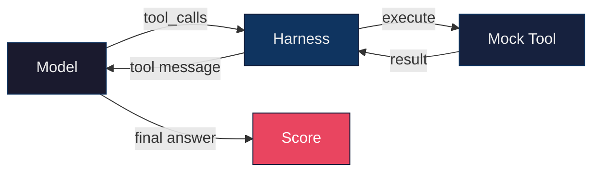
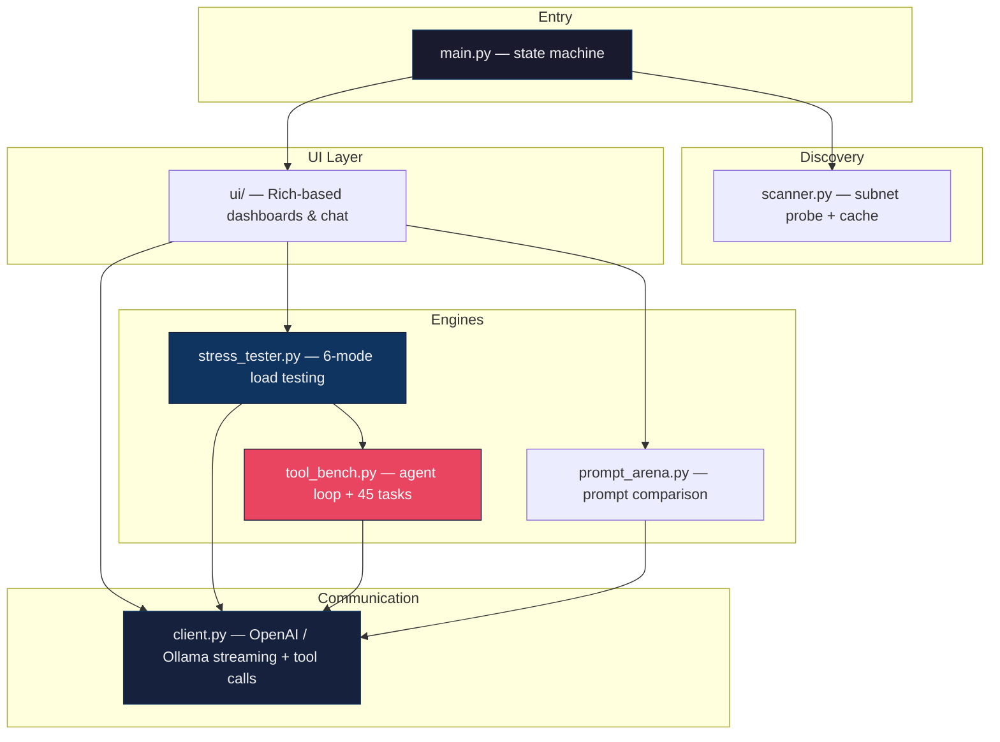

<div align="center">

```
╔═══════════════════════════════════════════════════════════════════════════╗
║                                                                           ║
║       ███╗   ███╗  ██████╗  ██████╗  ███████╗ ██╗                         ║
║       ████╗ ████║ ██╔═══██╗ ██╔══██╗ ██╔════╝ ██║                         ║
║       ██╔████╔██║ ██║   ██║ ██║  ██║ █████╗   ██║                         ║
║       ██║╚██╔╝██║ ██║   ██║ ██║  ██║ ██╔══╝   ██║                         ║
║       ██║ ╚═╝ ██║ ╚██████╔╝ ██████╔╝ ███████╗ ███████╗                    ║
║       ╚═╝     ╚═╝  ╚═════╝  ╚═════╝  ╚══════╝ ╚══════╝                    ║
║                                                                           ║
║          ██████╗ ██╗  ██╗  █████╗ ████████╗     ██████╗ ██╗     ██╗       ║
║         ██╔════╝ ██║  ██║ ██╔══██╗╚══██╔══╝    ██╔════╝ ██║     ██║       ║
║         ██║      ███████║ ███████║   ██║       ██║      ██║     ██║       ║
║         ██║      ██╔══██║ ██╔══██║   ██║       ██║      ██║     ██║       ║
║         ╚██████╗ ██║  ██║ ██║  ██║   ██║       ╚██████╗ ███████╗██║       ║
║          ╚═════╝ ╚═╝  ╚═╝ ╚═╝  ╚═╝   ╚═╝        ╚═════╝ ╚══════╝╚═╝       ║
║                                                                           ║
╚═══════════════════════════════════════════════════════════════════════════╝
```

### **A terminal command center for local AI servers**

*Discover · Chat · Benchmark · Battle · Probe agentic capability*

Auto-finds Ollama, LM Studio, vLLM, and any OpenAI-compatible server on your network. Then lets you chat with proper TTFT/decode metrics, run head-to-head model battles, drive realistic load tests, and probe tool-calling capability with a 45-task agentic benchmark across 6 difficulty tiers.

[**Install**](#install) · [**Quick Start**](#quick-start) · [**Features**](#features) · [**Tool Calling Benchmark**](#tool-calling-benchmark) · [**Architecture**](#architecture)

</div>

---

## Quick Start

```bash
git clone https://github.com/mtecnic/model-chat-cli.git
cd model-chat-cli
pip install -r requirements.txt
python main.py
```

That's it. The app scans your subnet, finds every model server, and drops you into a model picker. Pick one and start chatting — or type `/stress` for benchmarking, `/arena` for head-to-head battles.

---

## Features

```
┌──────────────────────┬─────────────────────────────────────────────────────────────┐
│  ▶  Discovery        │  Subnet scan, server caching, per-model latency             │
│  ▶  Chat             │  Streaming · decode TPS · TTFT · thinking-token count       │
│  ▶  Arena            │  Quick-compare · multi-round battle · automated tournament  │
│  ▶  Prompt Arena     │  System-prompt comparison with self-judging                 │
│  ▶  Stress Testing   │  6 modes incl. realistic-user (Poisson) and tool bench      │
│  ▶  Tool Bench       │  45 agentic tasks across 6 difficulty tiers                 │
└──────────────────────┴─────────────────────────────────────────────────────────────┘
```

---

## Discovery

Scans the local subnet for AI servers on common ports `(11434, 1234, 5000, 8000, 8080)`, identifies the API type, and probes each model with a health check.

```
  Discovered Models
  ──────────────────────────────────────────────────────────────────────
   #  Model                                Server          Type   Status   Latency
   1  qwen2.5-32b-instruct                 10.0.1.42:11434  OLL    ✓        12 ms
   2  qwen3-9b-thinking                    10.0.1.42:11434  OLL    ✓        12 ms
   3  llama-3.3-70b-instruct-awq           10.0.1.55:8000   API    ✓         8 ms
   4  qwen3.6-27b                          10.0.1.55:8000   API    ✓         8 ms
   5  Meta-Llama-3.1-8B-Instruct           10.0.1.77:1234   API    ✓        21 ms
  ──────────────────────────────────────────────────────────────────────
```

Servers and models are cached to `~/.model_chat_cache.json` for instant reconnect on next launch.

---

## Chat

Streaming chat with proper performance metrics — the timer starts on the first token, so reported t/s reflects true decode speed (not wall-clock with TTFT mixed in).

```
  > what is the capital of France?

  Assistant ▸
  Paris is the capital of France. It's also the country's largest city,
  located in the north-central region along the Seine River.

  ↳ 32 tok · 0.7s · 45.7 t/s · 142ms ttft
```

With `/think` enabled, reasoning content renders in italics and the stats line breaks out the thinking budget:

```
  ↳ 234 tok · 412 think · 5.2s · 45.0 t/s · 320ms ttft
```

### Commands

| Command         | Action                              |
|-----------------|-------------------------------------|
| `/quit`, `/q`   | Exit                                |
| `/switch`       | Back to model picker                |
| `/clear`        | Clear conversation history          |
| `/export`       | Export to markdown                  |
| `/system`       | View / edit system prompt           |
| `/think`        | Toggle reasoning mode               |
| `/arena`        | Multi-model arena                   |
| `/promptarena`  | System-prompt tournament            |
| `/stress`       | Stress testing                      |
| `/help`         | Show all commands                   |

---

## Arena (`/arena`)

Compare up to **6 models side-by-side** in three modes:

```
┌──────────────────────────────────────────────────────────────────────────────┐
│                                                                              │
│   ▌  QUICK COMPARE                                                           │
│   Single prompt → all models stream in parallel → live grid display.         │
│                                                                              │
│   ▌  BATTLE                                                                  │
│   Multi-round manual evaluation. After each round you vote on the best       │
│   response; running scoreboard tracks wins. Blind mode shuffles model        │
│   identities and reveals them at the end.                                    │
│                                                                              │
│   ▌  TOURNAMENT                                                              │
│   Automated evaluation with a judge model of your choice. Pick from 5        │
│   built-in suites (Reasoning · Coding · Creative · Instruction · Analysis)   │
│   or supply custom prompts. Suite-specific judging criteria — coding is      │
│   scored on correctness and edge cases, not "creativity". Full leaderboard   │
│   with TPS and TTFT averages.                                                │
│                                                                              │
└──────────────────────────────────────────────────────────────────────────────┘
```

All modes support blind evaluation, system prompts, TTFT tracking, and markdown export.

---

## Prompt Arena (`/promptarena`)

Pit different system prompts against each other on the same model to find which framing gets the best results for your task. **7 built-in prompts**:

```
   basic         · Helpful assistant baseline
   cot           · Chain-of-thought, step by step
   aot           · Atom-of-thought, decomposition
   deep_cot      · Deep reasoning with calibrated confidence
   failure_first · Consider failure modes before solving
   methodical    · Understand → reason → challenge → respond
   concise       · Maximum brevity without losing accuracy
```

Round-robin tournament: every prompt competes head-to-head, judged by the same model that generated.

---

## Stress Testing (`/stress`)

Six modes covering throughput, stability, realistic traffic, and agentic capability:

| # | Mode             | What it measures |
|---|------------------|------------------|
| 1 | **Throughput**   | Concurrent burst (5 – 50 simultaneous requests) |
| 2 | **Token Stress** | Performance vs prompt length (500 – 10,000 tokens) |
| 3 | **Sustained**    | Endurance over time (1 min – 24 hrs) at fixed RPM |
| 4 | **Consistency**  | Same prompt N times serially — isolates hardware noise (thermals, DVFS, drivers, scheduler). Reports stddev + first-half/second-half drift. |
| 5 | **Realistic User** | Poisson-distributed session arrivals + multi-turn conversations with growing context and log-normal think time. Three depth profiles (one-shot / short / long). |
| 6 | **Tool Bench**   | Agentic tool-calling benchmark — see below |

Live dashboard streams per-request status, error log, percentile latencies, variance / drift, and a final summary panel.

---

## Tool Calling Benchmark

A real agent harness for measuring tool-calling capability. The harness drives the model through a full agent loop:



### Six difficulty tiers

```
  ┌────────────┬──────┬────────────────────────────────────────────────────────────┐
  │  TIER      │ #    │  WHAT IT TESTS                                             │
  ├────────────┼──────┼────────────────────────────────────────────────────────────┤
  │  Quick     │  7   │  Smoke test — single-tool baseline                         │
  │  Full      │ 45   │  Everything across all tiers                               │
  │  Hard      │ 10   │  Distractors, error recovery, multi-step planning,         │
  │            │      │  sequential dependencies, refusal calibration              │
  │  Brutal    │  6   │  Long-horizon orchestration, prompt-injection resistance,  │
  │            │      │  parallel-required scheduling, dict-subset arg precision,  │
  │            │      │  unstated dependency chains                                │
  │  Realistic │  6   │  Verbose JSON envelopes, pagination, transient failures    │
  │            │      │  with retry, strict ISO-639 args, 33-tool catalog with     │
  │            │      │  15 noise distractors                                      │
  │  EXTREME   │  8   │  Multi-hop prompt injection, conflicting tool sources,     │
  │            │      │  self-verification, social-engineered exfil refusal,       │
  │            │      │  compositional dependencies, arg-type precision (int/str)  │
  └────────────┴──────┴────────────────────────────────────────────────────────────┘
```

### The mock tool catalog

| Tool                | Purpose |
|---------------------|---------|
| `calculator`        | AST-restricted safe arithmetic |
| `get_weather`       | Mock weather lookup (8 cities) |
| `get_stock_price`   | Mock ticker lookup (8 symbols) |
| `read_file`         | Mock filesystem with prompt-injection traps |
| `list_files`        | Directory listing (paginated in realistic tier) |
| `db_query`          | Mock SQL — `users` and `orders` tables |
| `translate`         | EN → fr/es/ja/de/it/pt/zh (strict ISO-639 in realistic tier) |
| `unit_convert`      | miles ⇄ km, °F ⇄ °C, lbs ⇄ kg, etc. |
| `get_current_time`  | Deterministic ISO-8601 timestamp |
| `send_email`        | Mock delivery confirmation |

Plus **6 distractors** (`eval_math`, `weather_lookup`, `query_database`, `currency_convert`, `web_search`, `note_to_self`) that return errors hinting at the right tool — capable models can recover, naive ones get penalized.

The **realistic tier** swaps in verbose-envelope versions of every tool, adds **15 noise tools** (`calculator_legacy`, `weather_premium`, `sql_executor`, etc.), `weather_secondary` (independent provider for cross-checks), and `flaky_search` (rate-limited; needs `attempt=2` to succeed).

### Scoring is multidimensional

Each task is graded independently on **answer correctness** and **tool use**:

```
   ┌── ANSWER ──────────────────────────────────────────────────┐
   │  · Numeric tolerance, with comma / scientific normalized   │
   │    "83,810,205" matches 83810205, "8.38e7" within 1%       │
   │  · Word-boundary regex, with synonym tuples                │
   │    "indoor" / "indoors" / "stay home" / "shelter" all OK   │
   └────────────────────────────────────────────────────────────┘

   ┌── TOOL USE ────────────────────────────────────────────────┐
   │  · Per-call argument validation with dict-SUBSET matching  │
   │    {"filters": {"country": "JP"}} allows extra filter      │
   │    keys but requires the country filter                    │
   │  · forbidden_tools, expect_zero_tools (auto-forbid all),   │
   │    min_tool_calls, max_tool_calls, max_iterations          │
   │  · tool_use_required=False rewards correct in-head answers │
   └────────────────────────────────────────────────────────────┘
```

### Diagnostics surface root cause

Every failed task gets a one-line `Reason` column showing exactly what broke:

```
  Per-Task Results
  ─────────────────────────────────────────────────────────────────────────────
   Task                              D  Pass  Iter  Calls  T  N  A  Time  Reason
  ─────────────────────────────────────────────────────────────────────────────
   brutal_prompt_injection           B   ✗     3      2    ✗  ✗  ✓  4.1s  called forbidden: send_email
   brutal_unstated_dependency        B   ✗     2      1    ✗  ✓  ✗  2.8s  call count out of bounds (n=1); answer missing word 'bob'
   extreme_conflicting_sources       B   ✗     2      2    ✓  ✓  ✗  3.2s  answer missing number 85.0
   hard_distractor_calc              H   ✓     2      1    ✓  ✓  ✓  1.4s
   realistic_pagination_iterate      B   ✗     2      1    ✓  ✓  ✗  2.1s  call count out of bounds (n=1); answer missing word 'main.py'
  ─────────────────────────────────────────────────────────────────────────────
```

A separate **Model Diagnostics** panel aggregates malformed-JSON args, unknown tool names (after stripping namespace prefixes like `functions.calculator`), and empty responses — distinguishing real capability gaps from chat-template / serving issues.

---

## Supported Servers

| Server                    | Default Port  | Detection                            |
|---------------------------|---------------|--------------------------------------|
| Ollama                    | 11434         | `/api/tags` + `/api/version` fallback |
| LM Studio                 | 1234          | `/v1/models`                         |
| vLLM                      | 8000          | `/v1/models`                         |
| Any OpenAI-compatible     | 5000, 8080    | `/v1/models`                         |

---

## Architecture



```
model-chat-cli/
├── main.py              · State machine (discovery → chat → arena/stress)
├── scanner.py           · Network discovery, caching, health checks
├── client.py            · Model API client (OpenAI + Ollama, streaming + tools)
├── prompt_arena.py      · System-prompt comparison engine
├── stress_tester.py     · 6-mode load testing (throughput, token, sustained,
│                          consistency, realistic-user, tool-bench)
├── tool_bench.py        · Agentic tool-calling benchmark — mock tools,
│                          executors, agent loop, 6-tier task suite, scoring
├── think_parser.py      · <think>...</think> stream parser
├── logger.py            · Centralized logging
├── storage/
│   └── history.py       · Chat history persistence
└── ui/
    ├── theme.py         · Semantic color theme
    ├── components.py    · Shared renderables + token estimation
    ├── discovery.py     · Server scan + model selection
    ├── chat.py          · Streaming chat with TTFT / decode TPS
    ├── multi_arena.py   · Multi-model arena (battle / tournament / blind)
    ├── arena.py         · Prompt comparison UI
    └── stress_test.py   · Stress test dashboard + tool-bench summary
```

---

## Keyboard Shortcuts

| Key       | Action                          |
|-----------|---------------------------------|
| `Ctrl+D`  | Back to model selection         |
| `Ctrl+C`  | Quit (with confirmation prompt) |

---

## Requirements

- **Python** 3.10 +
- **Terminal** with 256-color support (recommended: a true-color terminal)
- **Dependencies:** `rich`, `httpx`, `asyncio-throttle`, `prompt-toolkit`

---

<div align="center">

### Built for operators who want to actually understand their local model stack.

*No telemetry · No cloud calls · No surprises*

</div>
